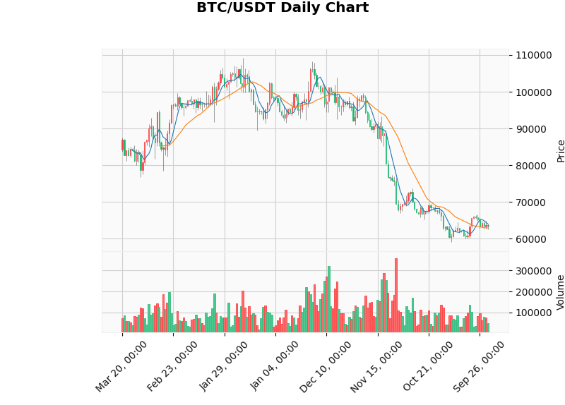

# Quant_Project : 파이썬을 활용한 비트코인 데이터 분석 및 시각화

## 1. 프로젝트 개요
이 프로젝트는 Python의 Pandas, mplfinance 라이브러리를 활용하여 비트코인(BTC/USDT)의 일봉 가격 데이터를 분석하고, 캔들과 이동평균선을 시각화하는 것을 목표로 합니다.

## 2. 주요 기능
- CSV 형태의 금융 시계열 데이터 로드 및 전처리 (데이터 클리닝)
- Pandas를 이용한 이동평균선(MA5, MA20) 계산
- mplfinance를 활용한 캔들 차트, 거래량, 이동평균선 시각화

## 3. 실행 결과

## 4. 학습 내용
- Pandas 를 활용한 데이터 조작 및 분석
- mplfinance 라이브러리를 활용한 데이터 시각화 방법 학습
- 데이터 클리닝(쉼표, 문자 제거 등)의 중요성 체득
- VS Code 환경에서의 파이썬 스크립트 실행 및 디버깅 과정 경험
